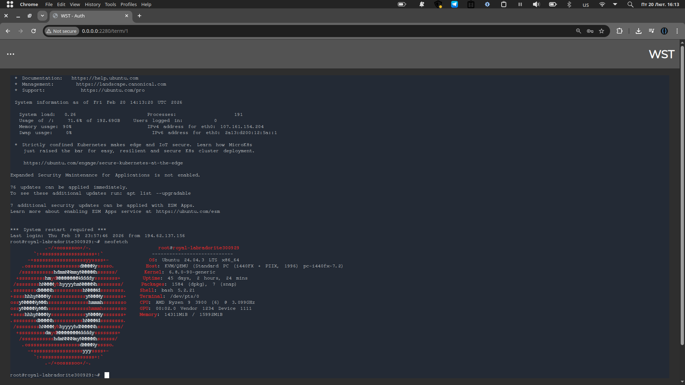

# Web Shell Terminal

## Description

Web Shell Terminal (WST) is a web-based SSH client for system administrators. If you manage many machines and users with different access levels, WST helps centralize account management by linking web and SSH accounts to your own groups and managing permissions through a convenient admin panel. The project supports PostgreSQL and SQLite databases.

### Example of CLI in WST


## Installation

### Important
Before running WST, update the `admin` passkey and the encryption key in `src/.env` to your own values

### Run via Docker
Clone the repository and run the included script:

```bash
git clone https://github.com/Sirzhik/Web-Shell-Terminal.git
cd Web-Shell-Terminal
sh fast-run.sh # simple demo of WST powered by SQLite
```

```bash
# Or you run example docker-compose if you want to:
docker compose -f example-docker-compose.yml build --no-cache
docker compose -f example-docker-compose.yml up
```

### Run without Docker
Clone the repository, create a Python virtual environment, install dependencies, and run the server from `src/`:

```bash
git clone https://github.com/Sirzhik/Web-Shell-Terminal.git
cd Web-Shell-Terminal

# Create and activate a virtual environment
python3 -m venv .
source ./bin/activate

# Install Python dependencies
pip install -r requirements.txt

# Install JavaScript dependencies (from the src directory)
cd src/
npm install @xterm/xterm

# Run the application
python3 main.py
```

Make sure you have both Python and npm available on your system before proceeding.

---

### Core Logic & Principles  

| Aspect | Explanation |
|--------|-------------|
| **Overall Architecture** | A thin FastAPI back‑end orchestrates HTTP routes (login, admin UI) and a WebSocket endpoint that bridges the browser to an SSH server. The design follows an event‑driven, layered pattern (HTTP ⇄ WebSocket ⇄ SSH ⇄ DB). |
| **Authentication & Authorisation** | `auth.py` implements an OAuth‑style token flow with password hashing. A FastAPI dependency `get_current_user` validates the token on every request and populates the request context. Authorisation rules (virtual user ↔ server ↔ group) are enforced before a WebSocket connection is accepted. |
| **Database Layer** | Asynchronous SQLAlchemy models live under `db/`. Pydantic schemas validate inbound data. The DB stores virtual SSH users, encrypted credentials, group mappings and server definitions. All DB interactions are performed with an async engine (SQLite by default, but any DB supported by SQLAlchemy can be swapped). |
| **SSH Session Handling** | `ssh.py` wraps **Paramiko**’s `SSHClient`. A single `SSHClient` connection is opened per WebSocket session, a channel is created, and a background thread reads `stdout`/`stderr`. The thread forwards data to the WebSocket via an async coroutine, while incoming keystrokes from the client are written to the SSH channel. Resize events from xterm.js are forwarded to Paramiko to keep the remote pseudo‑terminal in sync. |
| **WebSocket ↔ SSH Bridge** | `term.py` defines `TerminalSession`. It mediates the bidirectional flow: <br>1. On WebSocket connect → verify token → fetch virtual user credentials → open SSH channel. <br>2. Continuously read from SSH (via `asyncio.to_thread`) and push bytes to the WebSocket. <br>3. Forward WebSocket messages (key presses, resize payloads) to the SSH channel. <br>4. Gracefully close the SSH channel and the WebSocket on errors, disconnect, or client‑side closure. |
| **Frontend Terminal UI** | The UI is rendered with **Jinja2** templates (`templates/`). It embeds **xterm.js**, which provides a full‑featured terminal emulator. A small JavaScript client establishes the WebSocket (`/ws/ssh/{virtual_user_id}`), forwards keyboard input, and reacts to resize events. |
| **Containerisation** | A `Dockerfile` builds the service and a `docker‑compose.yml` wires environment variables (`SECRET_KEY`, DB credentials, etc.) and optional side‑car services (e.g., a production‑grade DB). This makes the application portable across development, staging and production environments. |
| **Lifecycle Management** | FastAPI startup/shutdown events initialise the async DB engine, create tables if needed, and clean up resources (close DB connections, terminate lingering SSH sessions). |

---

### Key Features  

- **Authenticated Web UI** – Login page with token‑based session handling.  
- **Admin Panel** – CRUD interfaces for virtual SSH users, groups, and server definitions (all backed by async SQLAlchemy).  
- **Browser‑Based Terminal** – Real‑time interactive SSH session displayed via xterm.js.  
- **WebSocket‑Driven Communication** – Low‑latency, full‑duplex streaming of terminal I/O.  
- **Dynamic Terminal Resizing** – Front‑end resize events are propagated to the remote pseudo‑terminal.  
- **Credential Encryption** – Stored SSH credentials are encrypted at rest and decrypted only when establishing a session.  
- **Role‑Based Access Control** – Users can only connect to servers allowed by their group mapping.  
- **Dockerised Deployment** – One‑command build and run, with environment‑driven configuration.  
- **Extensible Architecture** – Clear separation of concerns (auth, DB, SSH, WebSocket, UI) makes it easy to replace Paramiko with asyncssh or add new authentication back‑ends.  
- **Test Suite** – `pytest‑asyncio` based integration tests covering DB operations, authentication flow and WebSocket‑SSH interaction.

---

### Dependencies  

| Category | Library / Tool | Version (latest stable at time of writing) |
|----------|----------------|--------------------------------------------|
| **Web framework** | **FastAPI** | `0.110.0` |
| **ASGI server** | **Uvicorn** | `0.27.0` |
| **SSH client** | **Paramiko** | `3.4.0` |
| **Database ORM** | **SQLAlchemy** (async) | `2.0.23` |
| **Database driver** | **aiosqlite** (for SQLite) – optional | `0.20.0` |
| **Data validation** | **Pydantic** | `2.5.3` |
| **Template engine** | **Jinja2** | `3.1.3` |
| **Frontend terminal** | **xterm.js** (served as static assets) | `5.3.0` |
| **Password hashing** | **Passlib** (bcrypt) | `1.7.4` |
| **Docker** | Docker Engine & Docker Compose | latest |
| **Testing** | **pytest**, **pytest‑asyncio**, **httpx** | `8.2.2`, `0.23.0`, `0.27.0` |
| **Utilities** | **python‑dotenv** (env‑var loading) | `1.0.1` |
| **Optional async SSH** | **asyncssh** (if you replace Paramiko) | `2.14.1` |

*All dependencies are declared in `requirements.txt` (or `pyproject.toml` if Poetry is used) and installed via `pip install -r requirements.txt` inside the Docker image.*

---

**End of Overview**  

Feel free to request a deeper dive into any module, a diagram of the data flow, or suggestions for extending the platform.

## Executive Navigation Tree
- 📂 Authentication
  - [Login](#auth-router-login)
  - [Validate](#auth-router-validate)
  - [Logout](#auth-router-logout)
  - [Admin Login](#auth-router-admin-login)
  - [Auth Template](#auth-template)
- ⚙️ Administration
  - [Auth Middleware](#admin-auth-middleware)
  - [Panel View](#admin-panel-view)
  - [View Tables](#admin-view-tables)
  - [Add User](#admin-add-user)
  - [Logout](#admin-logout)
  - [Admin Panel Template](#admin-panel-template)
- 🛠️ Configuration
  - [Settings](#config-settings)
  - [Pydantic Schemas](#pydantic-schemas)
  - [Application Bootstrap](#application-bootstrap)
  - [Test DB Operator](#test-db-operator)
- 🔐 SSH & WebSocket
  - [SSH Session](#ssh-session)
  - [WS SSH Bridge](#ws-ssh-bridge)
- 📄 Templates
  - [Base Template](#base-template)
  - [Home Template](#home-template)
  - [Terminal Template](#terminal-template)
  - [Terms List Template](#termslist-template)
  - [Template App](#template-app)

 

 

**⚠️ Missing Code Fragment**  

The request calls for detailed, source‑grounded documentation of a **specific code fragment**. The repository listing you supplied includes file names and configuration files, but the actual Python source code (e.g., the contents of `src/term.py`, `src/ssh.py`, `src/auth.py`, etc.) was not included.

> *Information not present in the provided fragment.*  

Please provide the exact code snippet you’d like documented, and I will generate the requested markdown‑styled, table‑rich, anchor‑based documentation adhering to all constraints.

<a name="auth-router-login"></a>## `auth` Router – Login Endpoint  

| Entity | Type | Role | Notes |
|--------|------|------|-------|
| `router` | `APIRouter` | Registers `/auth/*` routes | Prefix **/auth**, tag **auth** |
| `credentials` | `AddUserSchema` | Incoming payload (`username`, `password`) | Validated by Pydantic |
| `request` | `Request` | Provides cookie access | `request.cookies.get("session")` |
| `session` | DB model | Current session record | Retrieved via `db_operator.get_session_by_session_str` |
| `response` | `JSONResponse` | Success payload & cookie setter | `set_cookie(key="session", httponly=True)` |

**Responsibility** – Authenticates a user, removes any stale session, creates a fresh session record, and returns a `JSONResponse` with an HTTP‑only cookie.  

**Logic Flow**  
1. Extract `session` cookie.  
2. Validate credentials via `db_operator.validate_credentials`.  
3. If a valid session exists and is not expired → `HTTP_208_ALREADY_REPORTED`.  
4. On success: `await db_operator.remove_session(current_session)`.  
5. Retrieve user (`db_operator.get_user_by_username`).  
6. Create new session (`db_operator.create_session(user.id, int(time()))`).  
7. Attach cookie and return response.  

> **⚠️** If credential check fails, a `401 UNAUTHORIZED` is raised – no cookie is set.

<a name="auth-router-validate"></a>## Session Validation Endpoints  

| Entity | Type | Role | Notes |
|--------|------|------|-------|
| `current_session` | `str` | Cookie value | `request.cookies.get("session")` |
| `session` | DB model | Session lookup | `db_operator.get_session_by_session_str` |
| Return | `dict` | `{ "message": "Session is valid" }` | Only on successful check |

Both `/validate` (user) and `/validate-admin` follow identical steps: missing cookie → `401`; missing/expired DB record → `401`; otherwise a success message. The admin variant uses `admin_session` cookie and `db_operator.get_admin_session_by_field`.

<a name="auth-router-logout"></a>## Logout Endpoint  

| Entity | Type | Role | Notes |
|--------|------|------|-------|
| `current_session` | `str` | Cookie to delete | Retrieved before removal |
| `response` | `JSONResponse` | Payload + cookie deletion | `delete_cookie(key="session")` |

The route deletes the `session` cookie, calls `db_operator.remove_session` if a cookie existed, and returns a success JSON.

<a name="auth-router-admin-login"></a>## Admin Login Endpoint  

| Entity | Type | Role | Notes |
|--------|------|------|-------|
| `credentials` | `PasswordSchema` | Admin password only | Validated by `db_operator.validate_admin_credentials` |
| `current_session` | `str` | `admin_session` cookie | May be absent |
| `new_session` | DB model | Admin session record | Created via `db_operator.create_admin_session` |
| `response` | `JSONResponse` | Success payload & cookie | `set_cookie(key="admin_session", httponly=True)` |

Logic mirrors user login: reject if an un‑expired admin session exists, otherwise validate password, purge any prior admin session, create a new one, set the `admin_session` cookie, and return success.  

All interactions depend exclusively on the **db_operator** façade; no external libraries beyond FastAPI, Pydantic, and standard `time` are referenced in this fragment.

<a name="admin-auth-middleware"></a>## Admin Authentication Middleware  

| Entity | Type | Role | Notes |
|--------|------|------|-------|
| `request` | `Request` | Incoming HTTP request | Provides cookie access via `request.cookies.get` |
| `current_session` | `str` | Cookie value `"admin_session"` | Retrieved from request |
| `session` | DB model (`AdminSessions`) | Admin session record | Fetched with `db_operator.get_admin_session_by_field('session', …)` |
| `response` | `JSONResponse` | HTTP 401 on failure | `status_code=401`, `content={"detail": …}` |
| `call_next` | `Callable` | Pass‑through to next handler | Executed only when session is valid |

**Responsibility** – Guarantees that every admin‑only route is accessed only with a valid, non‑expired admin session cookie.  

**Logic Flow**  
1. Extract `admin_session` cookie.  
2. If missing → return 401 JSON.  
3. Query DB for matching session.  
4. If not found or `session.expires_at < int(time())` → 401 JSON.  
5. Otherwise forward request (`await call_next(request)`).  

> **⚠️** No side‑effects other than the DB read; the middleware never creates or deletes sessions.

<a name="admin-panel-view"></a>## Admin Panel HTML View  

| Entity | Type | Role | Notes |
|--------|------|------|-------|
| `request` | `Request` | Provides context for Jinja2 | Passed unchanged |
| `templates` | `Jinja2Templates` | Renders `admin_panel.html` | Returns `TemplateResponse` |

**Responsibility** – Serves the static admin UI page. No database interaction occurs in this handler.

<a name="admin-view-tables"></a>## `/view-tables` Endpoint (Admin API)  

| Entity | Type | Role | Notes |
|--------|------|------|-------|
| `db_operator` | façade | Reads full tables | `get_full_table(Model)` for each core model |
| Return | `dict` | JSON payload of all tables | Keys: `virtual_users`, `sessions`, `web_users`, `groups`, `group_to_server`, `admin_sessions` |

**Logic Flow** – Parallel async calls retrieve every table; result is returned as a plain JSON dictionary.

<a name="admin-add-user"></a>## `/add_user` Endpoint  

| Entity | Type | Role | Notes |
|--------|------|------|-------|
| `user` | `AddUserSchema` | Input payload (validated by Pydantic) | Contains `username` and `password` |
| `db_operator.add_user` | coroutine | Persists new `WebUsers` record | Returns ORM instance with `username` & `id` |
| Return | `dict` | Success JSON | `{"user": user.username, "id": user.id}` |

**Responsibility** – Creates a new web‑user; integrity errors are currently suppressed (commented out).

<a name="admin-logout"></a>## Admin Logout Endpoint  

| Entity | Type | Role | Notes |
|--------|------|------|-------|
| `request` | `Request` | Accesses cookies | `request.cookies.get("admin_session")` |
| `response` | `JSONResponse` | Payload & cookie deletion | `delete_cookie(key="admin_session")` |
| `db_operator.remove_admin_session` | coroutine | Deletes session record if present | Called with cookie value |

**Logic Flow**  
1. Build success JSONResponse.  
2. Delete `admin_session` cookie on client.  
3. If the cookie existed, remove the DB record.  
4. Return the response.  

> **⚠️** All other admin routes (`add_ssh_account`, `link_group_to_server`, `add_group`, `set_group_for_user`, `remove_*`) follow the same pattern: receive a validated Pydantic schema, invoke a single `db_operator` method, and return a concise JSON result or raise an `HTTPException` on `IntegrityError`. No external libraries beyond FastAPI, Pydantic, and the internal `db_operator` façade are used.

<a name="config-settings"></a>## `Config` – Environment Settings  

| Entity | Type | Role | Notes |
|--------|------|------|-------|
| `Config` | `BaseSettings` | Holds application configuration loaded from **.env** | Fields: `SECRET`, `ADMIN_PASSWORD`, `PORT`, `HOST`, DB connection params |
| `config` | `Config` instance | Global settings object imported by other modules | Created at import time |

**Responsibility** – Centralises all configurable values; pydantic‑settings reads **.env** (if present) and falls back to defaults.  

**Visible Interactions** – Other modules import `config` (e.g., `uvicorn.run` in `main.py`). No runtime side‑effects beyond environment loading.  

**Logic Flow** – Class definition → pydantic reads env variables → instance `config` is created.  

---

<a name="pydantic-schemas"></a>## Request Schemas (`src/db/schemas.py`)  

| Entity | Type | Role | Notes |
|--------|------|------|-------|
| `AddUserSchema` | `BaseModel` | Validate `/admin/add_user` payload | `username`, `password` |
| `AddVirtualUserSchema` | `BaseModel` | Payload for virtual SSH account creation | Optional `password`, `ssh_key`, etc. |
| `AddGroupSchema` | `BaseModel` | Group creation payload | `name` |
| `SetGroupForUserSchema` | `BaseModel` | Associate user ↔ group | `user_id`, `group_id` |
| *(others)* | `BaseModel` | Various admin actions (link, validate, etc.) | Field names match endpoint expectations |

**Responsibility** – Enforce strict typing/validation for every admin‑API request; FastAPI uses them automatically.  

**Visible Interactions** – Consumed by admin routers (`db/admin_routers/*.py`). No I/O performed here.  

**Logic Flow** – Class definition → FastAPI parses incoming JSON → raises 422 on mismatch.  

---

<a name="application-bootstrap"></a>## FastAPI Application Bootstrap (`src/main.py`)  

| Entity | Type | Role | Notes |
|--------|------|------|-------|
| `lifespan` | async context manager | Initialise DB on startup, placeholder for shutdown | Calls `await db_operator.init_db()` |
| `app` | `FastAPI` | Core ASGI application | Uses `lifespan` |
| `app.mount('/static/...')` | `StaticFiles` | Serve node_modules & static assets |
| `app.include_router(ssh_router)` | `APIRouter` | WebSocket SSH endpoint |
| `app.include_router(auth_router)` | `APIRouter` | Authentication routes |
| `app.mount('/term', template_app)` | `FastAPI` sub‑app | Renders terminal pages |
| `app.mount('/admin', admin_app)` | `FastAPI` sub‑app | Admin UI & API |
| `homepage` / `auth_page` | view functions | Return `TemplateResponse` for home & login pages | Use `templates` Jinja2 instance |
| `uvicorn.run` (if `__main__`) | server start | Binds to `config.HOST` and `config.PORT` |

**Responsibility** – Wire together all components, provide static serving, mount sub‑applications, and expose two simple HTML endpoints.  

**Visible Interactions** –  
- Calls `db_operator.init_db()` during startup.  
- Delegates request handling to imported routers (`term.router`, `auth.router`, `admin` app).  
- Renders Jinja2 templates for `/` and `/auth`.  

**Technical Logic Flow**  
1. Import modules and `config`.  
2. Define `lifespan` to bootstrap DB.  
3. Instantiate `FastAPI` with `lifespan`.  
4. Mount static directories.  
5. Include SSH and auth routers.  
6. Mount template‑based sub‑apps for terminal and admin.  
7. Define two GET handlers returning `TemplateResponse`.  
8. If run as script, start Uvicorn using host/port from `config`.  

> **⚠️** No side‑effects other than DB initialization and static mounting; template rendering does not touch the database.

<a name="ssh-session"></a>## `SSHSession` – WebSocket ↔ SSH Bridge  

| Entity | Type | Role | Notes |
|--------|------|------|-------|
| `ws` | `WebSocket` | Destination for terminal output & source for input | Passed from FastAPI router |
| `host` | `str` | Remote SSH host | ‑ |
| `port` | `int` | SSH port (default 22) | ‑ |
| `username` | `str` | SSH login name | ‑ |
| `password` | `str | None` | Password‑based auth | Ignored if `pkey` supplied |
| `pkey` | `str | None` | PEM‑encoded private key | Used with `key_type` |
| `key_type` | `str | None` | Identifier for key class (`RSA`, `ECDSA`, `Ed25519`) | Must exist in `k_types` |
| `passphrase` | `str | None` | Decrypts `pkey` when encrypted | ‑ |
| `termsize` | `dict | None` | Initial PTY size (`cols`, `rows`) | Defaults to 80×24 |
| **Internal** | | | |
| `ssh` | `paramiko.SSHClient | None` | Live SSH client | Created on `connect()` |
| `chan` | `Channel` | Interactive shell channel | `invoke_shell(term="xterm")` |
| `loop` | `asyncio.AbstractEventLoop` | Event loop for thread‑to‑coroutine bridge | Set after connection |
| `stop_event` | `asyncio.Event` | Signals reader thread termination | ‑ |
| `queue` | `asyncio.Queue` | Buffers bytes from SSH to WS | Maxsize = 100 |

**Responsibility**  
`SSHSession` encapsulates the life‑cycle of a Paramiko SSH session and forwards its I/O over a FastAPI `WebSocket`. It creates the SSH client, spawns a blocking reader thread (`ssh_reader`), buffers incoming bytes in an `asyncio.Queue`, and pushes them to the client via `ws_writer`. It also provides graceful shutdown of channel and client.

**Visible Interactions**  
- **Input**: `WebSocket` instance from the `/ws/ssh/{virtual_user_id}` endpoint.  
- **Output**: Binary frames sent to the same `WebSocket`.  
- **External**: Calls `paramiko.SSHClient.connect` (wrapped in `asyncio.to_thread`) and `ssh.invoke_shell`.  
- **Side‑effects**: Opens a network socket to the remote host; closes it on error or explicit `close()`.

**Technical Logic Flow**  
1. `__init__` stores connection parameters, sets default PTY size, and initialises placeholders.  
2. `await connect()`  
   - Instantiates `paramiko.SSHClient`, applies `AutoAddPolicy`.  
   - Builds `kwargs` for `ssh.connect`; if `pkey` is provided, validates `key_type` against `k_types` and loads the key from a `StringIO`.  
   - Executes the blocking `ssh.connect` in a thread via `asyncio.to_thread`.  
   - On success, opens an interactive shell (`invoke_shell`), forces blocking mode, and resizes PTY.  
   - Captures the current event loop, creates `stop_event` and a bounded `queue`.  
   - Returns `True`; on any exception it closes the WebSocket (code 1011) and the SSH client, then returns `False`.  
3. `ssh_reader()` runs in a separate thread: repeatedly reads up to 1024 bytes from `chan`, enqueues them with `asyncio.run_coroutine_threadsafe` onto the stored loop until `stop_event` is set or EOF.  
4. `await ws_writer()` runs as an async task: pulls bytes from `queue` and forwards them to `ws.send_bytes`.  
5. `await close()` shuts down `chan` and `ssh` safely, swallowing any errors.

> **⚠️** The SSH connection is performed in a thread to avoid blocking the event loop; ensure the thread is cancelled by setting `stop_event` before application shutdown.  

This fragment constitutes the core transport layer between the browser terminal (xterm.js) and the remote SSH host.

<a name="admin-panel-template"></a>
## `admin_panel.html` – Admin UI Structure  

**Responsibility**  
Renders the *Admin panel* page, extending `base.html`. It provides three management sections (Web Users, Groups, Servers) each with *Add* forms and placeholder containers (`#users_list`, `#groups_list`, `#servers_list`) where client‑side JavaScript will inject data.

**Visible Interactions**  

| Entity | Type | Role | Notes |
|--------|------|------|-------|
| `request` | `FastAPI Request` | Jinja2 context | Used to read cookies (`session`, `admin_session`) – not directly displayed. |
| `static/js/*.js` | `script` | Front‑end logic | `admin_panel.js`, `server_settings.js`, `server_links_handler.js`, `user_settings.js`, `user_group_handler.js`, `form_send.js`. |
| Forms (`#addUserForm`, `#addGroupForm`, `#addServerForm`) | HTML `<form>` | Collect data → POST via `form_send.js` to endpoints (`/admin/add_user`, `/admin/add_group`, `/admin/add_ssh_account`). |
| Lists (`#users_list`, `#groups_list`, `#servers_list`) | `<div>` | Target for dynamic list rendering by JS. |

**Technical Logic Flow**  
1. Template inheritance pulls shared layout from `base.html`.  
2. `<script>` tags load admin‑panel related modules; order is as written.  
3. Each *section* renders:  
   - Title header (`<h1>`).  
   - “New …” button with `data-toggle` attribute – UI toggles visibility of the associated hidden form.  
   - Hidden `<form>` (`class="hidden"`) containing inputs and a submit button; the form’s `data-endpoint` attribute tells `form_send.js` where to POST.  
   - Empty `<div>` placeholder for list population.  
4. At the bottom, `form_send.js` is loaded to attach submit handlers to all forms.  

**Data Contract**  

| Entity | Type | Role | Notes |
|--------|------|------|-------|
| `username` (User form) | `str` | New web user name | `required` attribute. |
| `password` (User form) | `str` | New web user password | `type="password"`. |
| `name` (Group form) | `str` | New group identifier | `required`. |
| `username` (Server form) | `str` | Remote SSH account | `required`. |
| `password` (Server form) | `str` | Remote SSH password | Optional. |
| `ssh_key` | `str` | PEM‑encoded private key | Optional textarea. |
| `ssh_key_type` | `str` (`NULL|RSA|ECDSA|Ed25519`) | Key class selector | Radio group, default `NULL`. |
| `passphrase` | `str` | Decrypts `ssh_key` if encrypted | Optional. |
| `domain` | `str` | SSH host address | `required`. |
| `port` | `str` | SSH port (default “22”) | `required`. |

> **⚠️** All forms are hidden by default (`class="hidden"`); UI scripts must toggle the `hidden` class before submission.  

---

<a name="auth-template"></a>
## `auth.html` – Authentication Page  

**Responsibility**  
Provides login interfaces for regular users and administrators, extending `base.html`. It conditionally displays forms based on the presence of `session` or `admin_session` cookies.

**Visible Interactions**  

| Entity | Type | Role | Notes |
|--------|------|------|-------|
| `request.cookies` | `Mapping` | Determines which forms to render | Checks `session` and `admin_session`. |
| `form_send.js` | `script` | Attaches submit handlers to both forms. |
| User login form | `<form data-endpoint="/auth/login" data-type='auth'>` | Sends credentials to `/auth/login`. |
| Admin passkey form | `<form data-endpoint="/auth/admin-login" data-type='passkey'>` | Sends passkey to `/auth/admin-login`. |

**Technical Logic Flow**  
1. Inherit layout from `base.html`.  
2. If `request.cookies.get('session')` is falsy, render the *User Login* form; otherwise it is omitted.  
3. If `request.cookies.get('admin_session')` is falsy, render the *Admin passkey* form; otherwise omitted.  
4. Each form contains minimal inputs (`username`/`password` or `password` only) and a submit button.  
5. `form_send.js` is loaded to handle AJAX submission based on the `data-endpoint` attribute.

**Data Contract**  

| Entity | Type | Role | Notes |
|--------|------|------|-------|
| `username` (user form) | `str` | Login identifier | Optional (not `required` in template). |
| `password` (user form) | `str` | User password | Optional. |
| `password` (admin form) | `str` | Admin passkey | Optional. |

> **⚠️** The template does not enforce `required` attributes; validation is delegated to client‑side JS or backend endpoints.  

These two fragments complete the UI layer of the **Web‑Shell‑Terminal** project, wiring static assets and form metadata to the FastAPI endpoints that manage users, groups, and SSH server definitions.

<a name="base-template"></a>
## `base.html` – Application Layout Scaffold  

**Responsibility**  
Provides the common HTML skeleton, static asset links, navigation bar, and a conditional menu that adapts to the presence of `session` or `admin_session` cookies.

**Visible Interactions**  

| Entity | Type | Role | Notes |
|--------|------|------|-------|
| `request.cookies` | Mapping | Drives conditional rendering of admin/user links, logout forms, and the inline admin‑login form. |
| `hiddenToggle.js` | script | Toggles the `hidden` class on the `#menu` element when the SVG button is clicked. |
| `logout.js` (module) | script | Binds click handlers to elements with `data-logouton` to call the appropriate logout endpoint. |
| `form_send.js` | script | Auto‑attaches AJAX submit for the embedded admin‑login form (only when a normal user is logged in). |

**Technical Logic Flow**  
1. Load XTerm CSS/JS, custom CSS, and utility scripts.  
2. Render the top navbar with a menu‑toggle SVG.  
3. Build the side menu: always show “Introduction”; if `admin_session` → admin panel & admin logout; if `session` → user terminals & user logout.  
4. When a logged‑in *non‑admin* user is present, inject an inline admin‑passkey form and load `form_send.js`.  
5. Insert the page‑specific body via ``.

**Data Contract**  

| Entity | Type | Role | Notes |
|--------|------|------|-------|
| `admin_session` cookie | `str` | Authorises admin UI elements | Presence = admin view. |
| `session` cookie | `str` | Authorises regular user UI elements | Presence = user view. |
| Admin‑login form `password` | `str` | Passkey submitted to `/auth/admin-login` | Handled by `form_send.js`. |

---

<a name="home-template"></a>
## `home.html` – Introduction Page  

**Responsibility**  
Renders static marketing text describing the Web‑Shell‑Terminal concept.

**Visible Interactions**  
None – pure HTML content placed inside ``.

**Technical Logic Flow**  
1. Extends `base.html`.  
2. Supplies page title “Introdution”.  
3. Emits a heading, sub‑heading, and descriptive paragraph.

**Data Contract**  
*No dynamic inputs* – the template is static.

---

<a name="terminal-template"></a>
## `terminal.html` – Embedded XTerm Container  

**Responsibility**  
Creates a `<div>` that the front‑end `terminal.js` script transforms into an interactive XTerm terminal bound to a remote SSH session.

**Visible Interactions**  

| Entity | Type | Role | Notes |
|--------|------|------|-------|
| `#terminal` div | HTML element | Host for XTerm instance | Receives `data-server-id="{{ id }}"` for server lookup. |
| `terminal.js` | script | Opens WebSocket `/ws/ssh/{id}`, pipes I/O, handles resize. |

**Technical Logic Flow**  
1. Extends `base.html`.  
2. Sets page title “Auth”.  
3. Renders a centered container with `id="terminal"` and injects the server identifier via Jinja variable `id`.  
4. Loads `terminal.js` which initiates the WS‑SSH bridge.

**Data Contract**  

| Entity | Type | Role | Notes |
|--------|------|------|-------|
| `id` (template variable) | `int`/`str` | Identifier of the SSH server to connect | Supplied by the FastAPI route handler. |

---

<a name="termslist-template"></a>
## `terms_list.html` – User Terminal Overview  

**Responsibility**  
Provides an empty `<div id="termsList">` that `my_terms.js` populates with clickable terminal cards.

**Visible Interactions**  

| Entity | Type | Role | Notes |
|--------|------|------|-------|
| `#termsList` div | HTML container | Receives dynamically generated terminal entries. |
| `my_terms.js` | script | Calls `/api/terminals` (or similar), builds UI elements, injects them into `#termsList`. |

**Technical Logic Flow**  
1. Extends `base.html`.  
2. Sets title “My terminals”.  
3. Emits a heading and the empty `#termsList` container.  
4. Loads `my_terms.js` which handles data fetching and DOM insertion.

**Data Contract**  

| Entity | Type | Role | Notes |
|--------|------|------|-------|
| Term list items | `object` (client‑side) | Represent each terminal (id, name, status). | Generated by `my_terms.js` from backend JSON. |

> **⚠️** All templates rely on the surrounding FastAPI request context; no additional server‑side validation is performed in the HTML layer.

<a name="ws-ssh-bridge"></a>
## `websocket_endpoint` – WebSocket ↔ SSH Bridge  

**Responsibility**  
Creates an authenticated WebSocket that forwards binary terminal I/O to a remote SSH session via `SSHSession`.

**Visible Interactions**  

| Entity | Type | Role | Notes |
|--------|------|------|-------|
| `ws` (WebSocket) | client‑side socket | Receives terminal size, binary keystrokes, and sends remote output | Cookies `session` used for auth |
| `db_operator` | async DB façade | Looks up virtual user, validates session, resolves group linkage | Throws on DB errors |
| `SSHSession` | wrapper around Paramiko | Opens SSH channel, reads remote stdout in a thread, writes to `ws` | Stops via `stop_event` |

**Technical Logic Flow**  
1. Retrieve *virtual user* (`db_operator.get_virtual_user_by_id`).  
2. Reject if missing (`ws.close(1008)`).  
3. Extract SSH connection data (`host`, `user`, `port`, decrypted `password`/`key`/`passphrase`).  
4. Validate HTTP session cookie → DB session → expiry check.  
5. Verify group‑link (`is_group_linked`).  
6. `await ws.accept()` then read initial terminal size (`ws.receive_json`).  
7. Instantiate `SSHSession` with all parameters and call `connect()`.  
8. Spawn **ssh_reader** (thread) and **ws_writer** (coroutine) tasks.  
9. Loop: `await ws.receive_bytes()` → forward to `ssh_session.chan.send`.  
10. On disconnect, set `stop_event`, close channel, await/ cancel tasks, finally `ssh_session.close()`.

**Data Contract**  

| Entity | Type | Role | Notes |
|--------|------|------|-------|
| `session` cookie | `str` | Authenticates the web user | Must exist; expiry checked against `session.expires_at`. |
| `virtual_user_id` path param | `int` | Identifies SSH target | Fetched from DB; must belong to the user’s group. |
| `termsize` payload | `dict` | Initial terminal dimensions (`cols`, `rows`) | Received as first JSON message after `ws.accept()`. |
| `ws` binary frames | `bytes` | Client keystrokes | Forwarded to `ssh_session.chan.send`. |
| `ssh_session` output | `bytes` | Remote stdout/stderr | Sent back to client by `ssh_session.ws_writer`. |

> **⚠️** All error paths close the socket with code 1008; no JSON error body is returned.

<a name="template-app"></a>
## `app` (utils/template.py) – FastAPI Core with Session Middleware  

**Responsibility**  
Bootstraps the FastAPI application, mounts static files, injects a session‑validation middleware, and serves three HTML views.

**Visible Interactions**  

| Entity | Type | Role | Notes |
|--------|------|------|-------|
| `request.cookies["session"]` | `str` | Session token for every HTTP request | Checked in middleware; missing → 401 JSON. |
| `db_operator` | async DB façade | Retrieves session, group, and server list | Used in middleware & `/get_servers_by_user_id`. |
| `templates` | Jinja2 engine | Renders `terms_list.html` and `terminal.html` | Context supplies `id` for the terminal view. |

**Technical Logic Flow**  
1. `app = FastAPI()` and mount `/static`.  
2. Middleware `add_process_time_header` runs on every request: fetches `session` cookie, validates via `db_operator.get_session_by_session_str`, rejects with `401` if absent/expired.  
3. `/get_servers_by_user_id` reads the same cookie, resolves the user’s group, returns the list of servers (`db_operator.get_servers_by_user_id`).  
4. `GET /` → `terms_list` returns `terms_list.html`.  
5. `GET /{id}` → `term` returns `terminal.html` with `{"id": id}`.

**Data Contract**  

| Entity | Type | Role | Notes |
|--------|------|------|-------|
| `session` cookie | `str` | Authorises all UI routes | Must map to a non‑expired DB session. |
| `id` path param | `int` | Server identifier for the terminal page | Injected into `terminal.html` context. |
| `/get_servers_by_user_id` JSON response | `list[object]` | Collection of server descriptors accessible to the user | Produced by DB query; no further validation in this layer. |

> **⚠️** The middleware aborts the request before any route logic runs; consequently, route handlers can assume a valid session.

<a name="test-db-operator"></a>
## `tests/test_db.py` – DatabaseOperator Unit‑Test Suite  

**Responsibility**  
Validates the **`DatabaseOperator`** CRUD & relationship helpers against an in‑memory SQLite DB. Each coroutine creates, queries, updates, or removes rows and asserts the returned ORM objects match expectations.

**Visible Interactions**  

| Entity | Type | Role | Notes |
|--------|------|------|------|
| `db_operator` | `DatabaseOperator` instance | Facade for async SQLAlchemy operations | Constructed with `engine=primary_engine` and `session=async_session`. |
| `primary_engine` | `AsyncEngine` | Provides DB connection for the test session | In‑memory URL `sqlite+aiosqlite:///:memory:`. |
| Model classes (`User`, `Group`, `VirtualUser`, …) | SQLAlchemy ORM | Persisted rows returned by `db_operator` methods | Accessed only through the operator; column values are verified. |
| `AsyncMock` / `pytest.mark.asyncio` | Test utilities | Enable async test execution | No external side‑effects. |

**Technical Logic Flow**  
1. **Setup** – Create async engine & session; instantiate `DatabaseOperator`.  
2. **`test_add_user`** – Calls `add_user(username, password)` → asserts object non‑null and `username` field.  
3. **`test_get_user_by_*`** – Retrieves the previously inserted user by name and by PK; checks identity fields.  
4. **`test_add_group` / `test_link_group_to_server`** – Inserts a `Group`, a `VirtualUser` (server), then links them; validates the link record.  
5. **`test_set_group_for_user`** – Updates a user’s `group_id`; verifies both returned and freshly fetched user reflect the change.  
6. **Server queries** – `test_get_server_by_id`, `test_get_servers_by_user_id` confirm lookup and group‑based filtering.  
7. **Utility checks** – `test_get_full_table` retrieves a raw list of dicts for `Groups`; `test_remove_group` ensures cascade delete clears related users and group references.  
8. **Teardown** – Implicit when the async engine is disposed at test exit.

**Data Contract**  

| Entity | Type | Role | Notes |
|--------|------|------|------|
| `username` / `password` args | `str` | Input to `add_user` / `add_virtual_user` | Passwords are stored hashed; test asserts inequality to the plain value. |
| `group_id`, `server_id`, `user_id` | `int` | FK identifiers for linking / updates | Obtained from the created objects’ `id` attribute. |
| Returned ORM objects | `User`, `Group`, `VirtualUser`, `GroupServerLink` | Output of each operator method | Must contain the fields asserted in the tests (e.g., `id`, `name`, `username`, `domain`, `port`). |
| `termsize`‑like payloads | *N/A* | Not used in this module | No terminal‑related data is involved. |

> **⚠️** All tests run against a fresh in‑memory database; any deviation from the described signatures will raise `AttributeError` or cause assertion failures.

